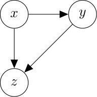
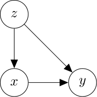

dagauss: Multivariate Gaussian DAGs
==========================

*Note:* Not even a pre-release, this is. 

Use this module to investigate multivariate Gaussian DAGs. Take the following simple collider:



What happens to the estimate of regression coefficient of `x` on `y` when we condition on `z`?

Or take the similar problem with a confounder:



What happens to the estimate of regression coefficient of `x` on `y` when we do not condition on `z`?

# Example

```python
G = nx.DiGraph()
G.add_nodes_from(["x", "y", "z"])
G.add_edges_from([("x", "y"),
                  ("z", "x"),
                  ("z", "y")])

G = populate_attributes(G)
H = calculate_H(G)

mean(H)
covariance(H)
```

# Installation
Copy the scripts and use them.

# Documentation
No documentation yet.